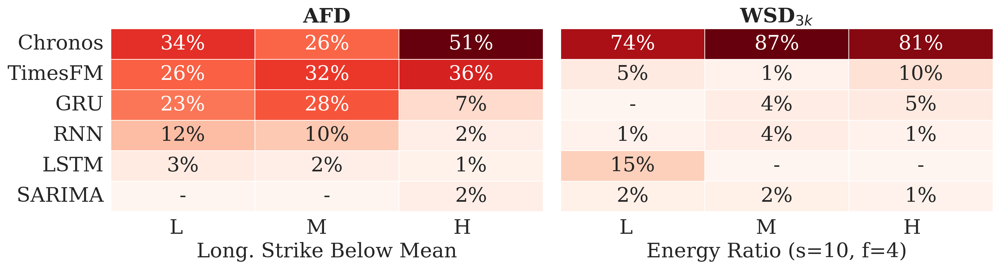
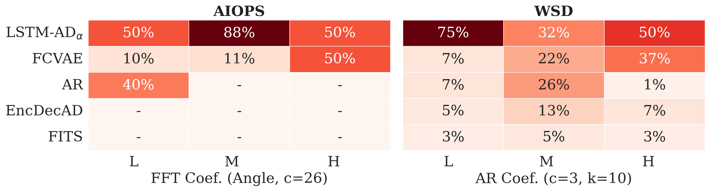
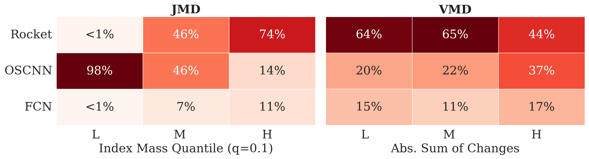

# Replication package for Meta-Learning for Time Series-based Tasks in Software Engineering

## Overview


This repository contains the complete replication package, including source code, model artifacts, and analysis scripts.

## Repository Structure
This repository contains four folders:
- *timeseries-forecasting*: this folder includes all the implementation of the TSF experiments
- *anomaly-detection*: this folder contains the implementation of TSAD experiments
- *steady-state*: this folder includes the SSD experiments implementation 
- *meta-src*: this folder includes the MALIAS implementation and evaluation scripts, including both training and application phases

## Datasets

In this work we employ the following datasets:
- **AFD (Azure Functions Dataset)**: Shahrad et al, "Serverless in the Wild: Characterizing and Optimizing the Serverless Workload at a Large Cloud Provider," in 2020 USENIX Annual Technical Conference (USENIX ATC 20), 2020.
- **WSD (Web Service Dataset)**: S. Zhang et al., “Efficient KPI Anomaly Detection Through Transfer Learning for Large-Scale Web Services,” IEEE J. Select. Areas Commun., 2022, doi: 10.1109/jsac.2022.3180785. 
- **WSD (Web Service Dataset) 3K**: S. Zhang et al., “Efficient KPI Anomaly Detection Through Transfer Learning for Large-Scale Web Services,” IEEE J. Select. Areas Commun., 2022, doi: 10.1109/jsac.2022.3180785. 
- **AIOPS Dataset**: https://github.com/NetManAIOps/KPI-Anomaly-Detection
- **JMD (Java Microbenchmark Dataset)**: L. Traini et al., “AI-driven Java Performance Testing: Balancing Result Quality with Testing Time,” Proceedings of the 39th IEEE/ACM International Conference on Automated Software Engineering. ACM, 2024. doi: 10.1145/3691620.3695017. 
- **VMD (Virtual Machine Dataset)**: Barrett et al., "Virtual machine warmup blows hot and cold," Proc. ACM Program. Lang. 1, OOPSLA, 2017. doi: https://doi.org/10.1145/3133876

In order to perform the experiments, you can download the data from each replication package and include them into this folder.

## Evaluation Tasks Experiments

### Time Series Forecasting (TSF)

The TSF experiments are included in *timeseries-forecasting* experiment.
Two folders are included in this project: *data-analysis* and *experiment*.
The *requirements.txt* file includes all the python dependences to run the data-analysis and experiments scripts.
The *data-analysis* folder contains two notebooks to preprocess the AFD and WSD datasets as described in the paper.
The csv files generated by the notebooks have to be included in the *data* directory inside the *experiment* folder.
The *experiment* folder includes the source code to perform the experiments. 

To perform the TSF experiments, run the following commands:

```bash
# source your-env/bin/activate

cd timeseries-forecasting/experiments/src
bash exec.sh
```

The extraction of SMAPE values (i.e., target metrics) is performed within the *TargetMetrics.ipynb* file inside the *experiment* folder.

### Time Series Anomaly Detection (TSAD)

The TSAD experiments are implemented inside the *anomaly-detection* folder.
The requirements.txt file includes all the necessary python libs required for running the scripts.
Refer to the README.md file inside the *anomaly-detection* folder for running the experiments and evaluations.

The target metric extraction is performed within the *TargetMetrics.ipynb* file inside the *anomaly-detection* folder.

### Steady State Detection (SSD)

The *steady-state* folder includes all the scripts for performing the SSD experiments.

For classifiers training, we leverage the replication package from *Traini et al., “AI-driven Java Performance Testing: Balancing Result Quality with Testing Time,” Proceedings of the 39th IEEE/ACM International Conference on Automated Software Engineering. ACM, 2024. doi: 10.1145/3691620.3695017*, which is available at: https://doi.org/10.5281/zenodo.13749258. 

The preprocessing scripts of the VMD dataset (to make it in the right format for the experiment) is available in the *steady-state/VMs/VMs-data-preparation* folder (`bash run.sh`).

The forkwise evaluation script for extracting the target metrics is the `steady-state/VMs/VMs-AIPT/forkwise_eval.py` file, that can be applied to both the datasets.


## Meta-Features Extraction

| Dataset (Task) | Rephrased Sentence                          | Command |
|--------|---------------------------------------------| ---- |
| AIOPS (TSAD)      | `meta-multitask/anomaly-detection/extract_features.py`    | `python extract_features.py --dataset-name AIOPS` |
| WSD (TSAD)     | `meta-multitask/anomaly-detection/extract_features.py`    | `python extract_features.py --dataset-name WSD` |
| WSD_3k (TSF)     | `timeseries-forecasting/experiment/src/extract_features.py`   | `python extract_features.py --dataset-name WSD_3k` |
| AFD (TSF)     | `timeseries-forecasting/experiment/src/extract_features.py`   | `python extract_features.py --dataset-name AFD` |
| JMD (SSD)     | `steady-state/jmh/extract_features.py`   | `python extract_features.py` |
| VMD (SSD)     | `steady-state/VMs/VMs-meta/extract_features.py`   | `python extract_features.py` |

## MALIAS Evaluation

To perform the randomized mapping for SSD described in the paper and reshape meta-features, use the `steady-state/jmh/format.py` and `steady-state/VMs/VMs-meta/format.py` scripts.

All the scripts needed for train and test MALIAS are located into the `meta-src` folder. 
Run the following script to perform the complete cross-validated evaluation procedure as described in the paper. 

```bash
bash run-meta.sh
```

## MALIAS Selection Rates

The notebook `meta-src/FeatureAnalysis.ipynb` contains the source code used to extract the feature importances and selection rates of MALIAS.

<p align="center">
  <b>Heatmaps showing how the value distribution of the top-ranked feature relates to its selection rate across algorithms for each dataset. Colors intensity reflects the percentage values reported in the map.</b>
</p>

<table width="70%" align="center">
  <tr>
    <td align="center">
      
      <br>
      <b>(a)</b> Time Series Forecasting
    </td>
  </tr>
  <tr>
    <td align="center">
      
      <br>
      <b>(b)</b> Time Series Anomaly Detection
    </td>
  </tr>
  <tr>
    <td align="center">
      
      <br>
      <b>(c)</b> Steady State Detection
    </td>
  </tr>
</table>


Figures above report the selection rates of the algorithms while the values of the most important meta-feature, according to the importance score of the Random Forest, change. Feature values are discretized based on their distribution in the dataset into three bins—L (low), M (medium), and H (high)—by partitioning it into three equal-frequency quantile bins.  

## Hyperparameter Tuning

Hyperparameters tuned for each regression model and their search spaces for each MALIAS variant.

<table>
<thead>
<tr>
<th><em>Regressor Variant</em></th>
<th><em>Hyperparameter</em></th>
<th><em>Search Space</em></th>
</tr>
</thead>
<tbody>
<tr>
<td rowspan="2">Linear Regression</td>
<td>Intercept (bias term)</td>
<td>{True, False}</td>
</tr>
<tr>
<td>Non-negative coefficients</td>
<td>{True, False}</td>
</tr>
<tr>
<td rowspan="3">KNN</td>
<td>Number of neighbors</td>
<td>{3, 5, 7, 11}</td>
</tr>
<tr>
<td>Neighbor weighting</td>
<td>{uniform, distance}</td>
</tr>
<tr>
<td>Distance metric</td>
<td>{Manhattan, Euclidean}</td>
</tr>
<tr>
<td rowspan="4">Decision Tree</td>
<td>Max depth</td>
<td>{None, 5, 10, 20}</td>
</tr>
<tr>
<td>Min samples to split</td>
<td>{2, 5, 10}</td>
</tr>
<tr>
<td>Min samples per leaf</td>
<td>{1, 2, 4}</td>
</tr>
<tr>
<td>Split criterion</td>
<td>{squared error, absolute error}</td>
</tr>
<tr>
<td rowspan="3">Random Forest</td>
<td>Number of trees</td>
<td>{10, 100, 1000}</td>
</tr>
<tr>
<td>Max depth</td>
<td>{None, 5, 20}</td>
</tr>
<tr>
<td>Split criterion</td>
<td>{squared error, absolute error}</td>
</tr>
</tbody>
</table>